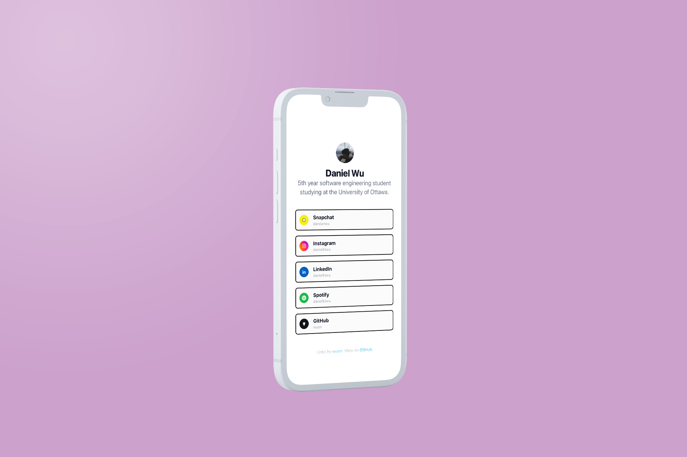

<p align="center">
  
</p>
<h1 align="center">
  Links
</h1>



Showcase your digital identity with this LinkTree clone. This starter ships with customizable links with the option to add icons. Feel free to fork and customize the project to fit your own needs!

## 🚢 Deploy (Vercel)

Deploy this starter with one click on [Vercel](https://vercel.com/):

[](https://vercel.com/new/clone?repository-url=https%3A%2F%2Fgithub.com%2Fwuon%2Flinks&project-name=links&repo-name=links)

## 🚀 Quick start

1.  **Install and setup**

```shell
git clone https://github.com/Wuon/links.git
cd links
npm install
npm start
```

Your site is now running at `http://localhost:8000`

2.  **Customizing your profile**

To update the title and description modify `gatsby-config.js`

```js
module.exports = {
  siteMetadata: {
    title: `Your desired title`,
    description: `Your desired description.`,
    ...
  },
  ...
}
```

To update the profile picture, replace `avatar.png` in `./src/images` with an image of your choice

```
.
├── src
│   ├── images
│   │   ├── avatar.png
```

3.  **Customizing your links**

To update the links you would like to display, head over to `./src/data/socials/socials.json`

```
.
├── src
│   ├── data
│   │   ├── socials
│   │   │   ├── socials.json
```

The format which the data is read is as follows:

```json
[
  {
    "platform": "Instagram",
    "username": "danielktwu",
    "icon": "../../images/instagram.png",
    "link": "https://www.instagram.com/danielktwu/"
  },
  ...
]
```

Note that `username`, `icon`, and `link` are optional as some platforms don't have a direct link.
